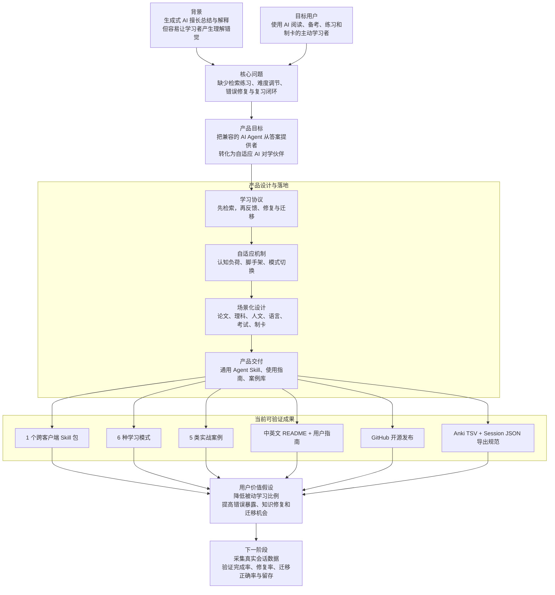
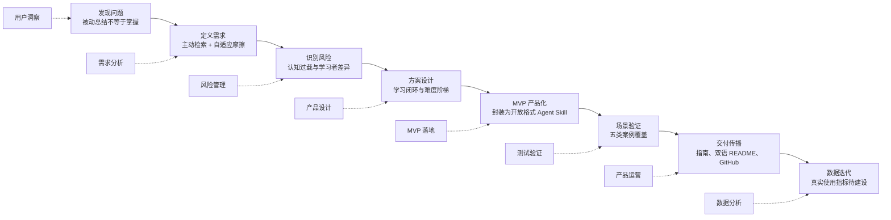
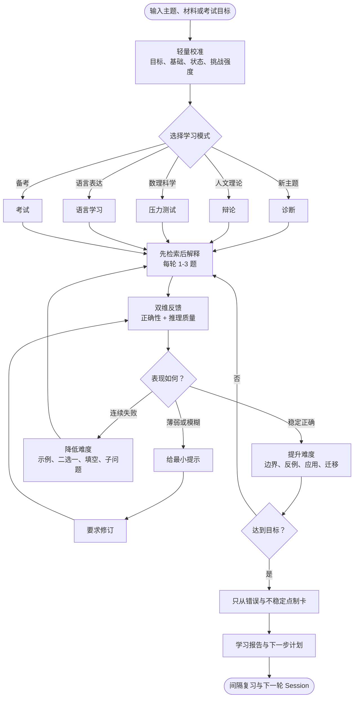
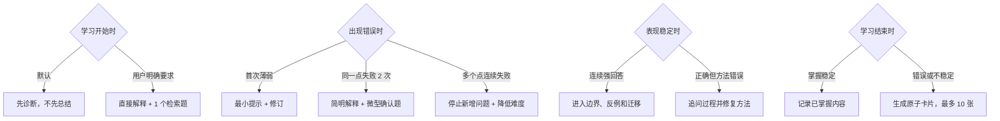
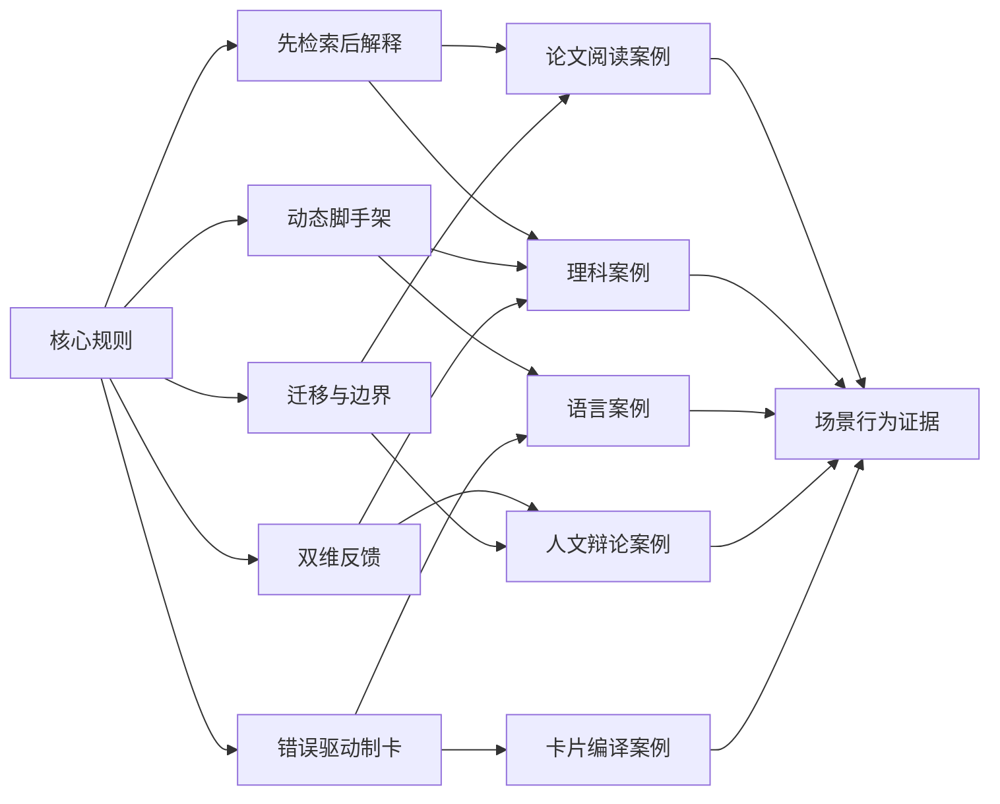
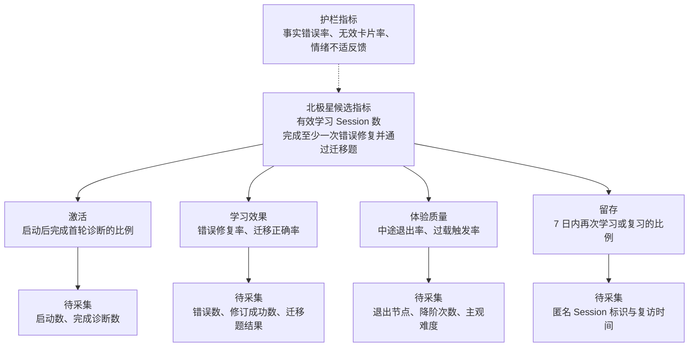
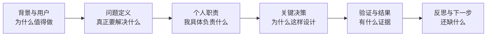

# AI Chavruta Learning：产品经理项目复盘信息图

这份文档按产品经理简历与面试所需的结构组织项目：业务背景、用户问题、产品目标、个人职责、关键决策、验证过程、结果证据和下一步指标。图中的事实来自当前仓库；尚未采集的数据统一标为“待补”，不使用无法举证的增长数字。

## 1. 一页项目案例

### 简历信息提取

| 简历字段 | 本项目可写内容 | 证据状态 |
| --- | --- | --- |
| 项目背景 | AI 学习工具偏重总结与答案输出，缺少主动检索和错误修复 | 已有产品判断 |
| 目标用户 | 使用 AI 进行论文阅读、备考、学科练习和语言训练的学习者 | 已定义 |
| 产品目标 | 构建可随学习者状态动态调节难度的 AI 对学 Skill | 已实现 |
| 个人职责 | 需求定义、学习流程设计、规则编排、场景拆分、案例验证、文档与开源发布 | 可由仓库举证 |
| 核心方案 | 诊断、检索、双维反馈、最小提示、错误修复、迁移、错题制卡 | 已实现 |
| 交付结果 | Skill、6 种模式、5 类案例、中英文文档、实战指南、GitHub 仓库 | 可量化举证 |
| 用户效果 | 完成率、修复率、迁移正确率、复访率 | 待真实用户数据 |

## 2. 关键节点与产品经理能力映射

### 节点复盘

| 阶段 | 关键决策 | 解决的问题 | 形成的资产 |
| --- | --- | --- | --- |
| 问题定义 | 不把“解释得清楚”视为“学习有效” | 产品价值容易停留在内容生成 | 主动学习价值主张 |
| 需求优化 | 增加认知负荷、学习差异和细粒度反馈 | 初学者可能受挫，连续错误可能过载 | 过载协议、脚手架、双维评分 |
| MVP 设计 | 用统一核心协议承载多个学习场景 | 单一 Prompt 难复用、难稳定 | `SKILL.md` 与 6 种模式 |
| 场景验证 | 用差异明显的任务检查行为一致性 | 规则可能只适用于单一学科 | 5 类实战案例 |
| 产品交付 | 同时建设安装、使用和理解路径 | 有功能但用户不会用 | README、USAGE、案例与信息图 |
| 开源发布 | 将可安装目录与项目文档分离 | 难传播、难复用、难贡献 | GitHub 开源仓库 |

## 3. 产品核心闭环

产品差异点不是“AI 会提问”，而是围绕学习表现形成可执行的状态转换：弱回答触发修复，连续失败触发降阶，稳定回答触发迁移。

## 4. 关键产品决策

这些决策体现了三类产品取舍：学习效果优先于即时满足、个体适配优先于固定流程、真实错误优先于批量内容生成。

## 5. 验证矩阵

当前验证能证明“产品规则在多场景下有明确预期与示例”，但不能直接证明“用户学习成绩提升”。简历与面试中应把两者分开陈述。

## 6. 指标体系：从交付指标走向效果指标

### 当前结果与待补数据

| 类型 | 当前能写入简历的事实 | 建议后续采集 |
| --- | --- | --- |
| 产品交付 | 完成 1 个可安装 Skill、6 种模式、5 类案例 | 安装量、仓库访问与使用人数 |
| 场景覆盖 | 覆盖论文、理科、人文、语言和卡片工作流 | 各场景启动率与完成率 |
| 使用门槛 | 提供中英文 README、实战指南和提示词模板 | 首次成功使用时间、激活率 |
| 学习效果 | 已定义修复与迁移机制 | 错误修复率、迁移正确率、延迟回忆率 |
| 用户体验 | 已定义过载识别与降阶协议 | 中途退出率、主观难度、满意度 |

## 7. 简历表述

### 可直接使用的事实版

> 独立设计并开源跨平台 AI Chavruta Learning Skill，针对生成式 AI 学习中“被动总结导致理解错觉”的问题，完成从需求定义、学习流程设计、认知负荷机制到开放 Agent Skills 格式产品化的 0→1 落地；构建诊断、辩论、理科压力测试、语言学习、考试和卡片编译 6 种模式，通过 5 类案例验证核心行为，并设计 Anki TSV、Session JSON 与可选 AnkiConnect 集成方案。

### 两条式简历版本

- 发现 AI 学习工具偏重答案生成、缺少错误修复与难度适配的问题，独立完成用户场景拆分和产品方案设计，建立“诊断—检索—反馈—修复—迁移—制卡”的自适应学习闭环。
- 将方案封装为可跨兼容客户端安装的 Agent Skill，交付 6 种学习模式、5 类验证案例、中英文项目文档和实战指南，并发布至 GitHub；同步设计 Anki 与结构化学习数据接口，为后续采集激活率、错误修复率和迁移正确率建立指标基础。

### 有真实数据后再使用的结果版

> 面向 `[用户规模]` 名学习者开展 `[周期]` 测试，实现首轮诊断完成率 `[X%]`、错误修复率 `[Y%]`、迁移题正确率提升 `[Z 个百分点]`，其中 `[场景]` 的 7 日复访率达到 `[R%]`。

方括号必须替换为真实可核验数据；没有数据时使用事实版，不填估算值。

## 8. 三分钟面试阐述

推荐讲述稿：

> 我观察到很多人用 AI 学习时，会直接索要总结和答案，短期感觉高效，但无法确认自己是否真正掌握。因此我把问题定义为：如何让 AI 不只负责解释，而是持续暴露并修复学习者的认知缺口。我负责从需求分析、核心流程、模式设计到 Skill 封装、案例验证和开源发布的完整过程。核心方案是先让用户从记忆中回答，再从正确性和推理质量两个维度反馈；首次错误只给最小提示，连续失败自动降阶，稳定后再进入边界和迁移。为了验证规则不是只对某一学科有效，我设计了论文、理科、人文、语言和制卡五类案例。目前项目已经形成可安装 Skill、用户指南和开源仓库，但现阶段证据主要是交付与场景覆盖，下一步会采集诊断完成率、错误修复率、迁移正确率和复访率，验证真实学习效果。

## 9. 面试追问准备

| 可能追问 | 回答重点 |
| --- | --- |
| 为什么不用普通 Prompt？ | Skill 能固化行为协议、触发条件、模式切换和输出标准，降低重复配置成本 |
| 用户的第一痛点是什么？ | 不是“AI 讲不清”，而是学习者无法暴露自己哪里没掌握 |
| 最关键的产品决策是什么？ | 默认先检索后解释，同时保留直接解释的用户控制权 |
| 如何处理初学者受挫？ | 识别过载信号，减少问题数量，使用识别题、二选一和 worked example |
| 如何证明有效？ | 当前有跨场景行为案例；学习效果仍需通过修复率、迁移正确率和延迟回忆验证 |
| 最大不足是什么？ | 尚未形成真实用户样本和埋点数据，效果指标仍是下一阶段工作 |
| 下一版优先做什么？ | 先建立最小数据记录，再进行小规模用户测试，而不是继续堆叠模式 |

## 10. 迭代复盘清单

1. 新需求对应的是明确用户问题，还是仅增加功能数量？
2. 哪个用户行为能证明本次迭代产生了学习价值？
3. 诊断问题是否准确暴露了学习者的真实水平？
4. 系统是否在错误后优先修复最高价值的一个问题？
5. 难度升降是否有行为证据，而不是凭感觉？
6. 迁移题是否真正改变了情境，而不只是换数字或措辞？
7. 卡片是否来自真实错误，并且足够原子化？
8. 新增规则是否在至少一个案例中验证？
9. 本轮结果能否沉淀为可量化指标或用户证据？
10. 如果只能保留一个改动，哪一个最接近北极星指标？
